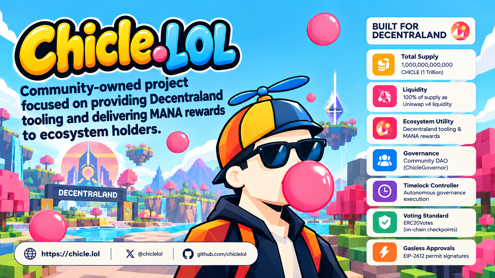

# Chicle.LOL — Smart Contracts Monorepo



[](LICENSE)
[-8247E5.svg)](https://polygonscan.com/address/0x76032b449e2bb6373646e6dda9f05a0d61ac3b72#code)
[](https://soliditylang.org/)
[](https://openzeppelin.com/contracts/)

Official smart contracts repository for **Chicle.LOL** (`CHICLE`), a community-owned Web3 ecosystem focused on developing Decentraland tooling, building metaverse utilities, and delivering MANA rewards to ecosystem holders.

---

## Project Overview

**Chicle.LOL** combines community governance, metaverse tooling, and decentralized finance liquidity into a unified token ecosystem:

- **Decentraland Tooling**: Purpose-built infrastructure and interactive tools supporting creators, builders, and scene developers within Decentraland.
- **MANA Rewards**: Mechanics designed to deliver MANA rewards and value accrual back to active ecosystem participants and token holders.
- **On-chain Governance**: Native token voting power backed by checkpointed history, enabling decentralization via a dedicated DAO Governor and Timelock Controller.
- **Concentrated Liquidity**: 100% of the token supply structured for deep liquidity and automated trading mechanisms on Uniswap v4.

---

## Official Polygon Mainnet Deployments (Chain ID: 137)

The core protocol contracts are deployed and verified on **Polygon Mainnet**:

### 1. Smart Contracts

| Contract Name | Contract Address | Verification Status | Key Characteristics |
|---|---|---|---|
| **`ChicleToken` (CHICLE)** | [`0x76032b449e2bb6373646e6dda9f05a0d61ac3b72`](https://polygonscan.com/address/0x76032b449e2bb6373646e6dda9f05a0d61ac3b72#code) | [Polygonscan](https://polygonscan.com/address/0x76032b449e2bb6373646e6dda9f05a0d61ac3b72#code) & [Sourcify](https://sourcify.dev/server/repo-ui/137/0x76032b449e2bb6373646e6dda9f05a0d61ac3b72) | 1,000,000,000,000 CHICLE total supply, ERC-20 + ERC20Permit + ERC20Votes checkpointing |
| **`ChicleTimelock`** | [`0x72ea26d9eb3df1fca4f1c92147245340deeba244`](https://polygonscan.com/address/0x72ea26d9eb3df1fca4f1c92147245340deeba244#code) | [Polygonscan](https://polygonscan.com/address/0x72ea26d9eb3df1fca4f1c92147245340deeba244#code) & [Sourcify](https://sourcify.dev/server/repo-ui/137/0x72ea26d9eb3df1fca4f1c92147245340deeba244) | `minDelay = 172,800` seconds (2 days), autonomous DAO treasury custodian |
| **`ChicleGovernor`** | [`0xac9b9bee40a29d29f08777ac7eb98a7095feaecc`](https://polygonscan.com/address/0xac9b9bee40a29d29f08777ac7eb98a7095feaecc#code) | [Polygonscan](https://polygonscan.com/address/0xac9b9bee40a29d29f08777ac7eb98a7095feaecc#code) & [Sourcify](https://sourcify.dev/server/repo-ui/137/0xac9b9bee40a29d29f08777ac7eb98a7095feaecc) | `votingDelay = 129,600` blocks (~3 days), `votingPeriod = 216,000` blocks (~5 days), threshold `100,000,000` CHICLE, quorum `4%` |

---

### 2. On-Chain Deployment & Role Initialization Transactions

All transactions were broadcast by the protocol deployer (`0xCa8F3933601b4627680d4F26791489ac434D3D77`) with 5 block confirmations on Polygon Mainnet:

| Operation | Transaction Hash | Explorer Link | Purpose & Effect On-Chain |
|---|---|---|---|
| **Deploy `ChicleToken`** | `0xc6be1c5b58bce1907bd2f144dc218bbadcc7525ebae1a6a1c09dcb43ae8b6977` | [View Tx](https://polygonscan.com/tx/0xc6be1c5b58bce1907bd2f144dc218bbadcc7525ebae1a6a1c09dcb43ae8b6977) | Minted initial 1,000,000,000,000 CHICLE supply to deployer account for liquidity seeding and ecosystem governance. |
| **Deploy `ChicleTimelock`** | `0xaf8cd2304cbca417152e0afef910998eebadff3fc82c93ceee78656d0fa15c75` | [View Tx](https://polygonscan.com/tx/0xaf8cd2304cbca417152e0afef910998eebadff3fc82c93ceee78656d0fa15c75) | Created the Timelock controller with 2-day mandatory delay (`172,800` seconds) and permissionless execution (`0x0`). |
| **Deploy `ChicleGovernor`** | `0x0bd15d602b991110515275923cca22e6b500d30fb3a44ad498da48a39f94144e` | [View Tx](https://polygonscan.com/tx/0x0bd15d602b991110515275923cca22e6b500d30fb3a44ad498da48a39f94144e) | Deployed DAO Governor orchestrator linked to `ChicleToken` and `ChicleTimelock`. |
| **Grant `PROPOSER_ROLE`** | `0x329e67a9287a1a984da7c21d7776cafed44af2ed43ed4ea3870353fc9f897652` | [View Tx](https://polygonscan.com/tx/0x329e67a9287a1a984da7c21d7776cafed44af2ed43ed4ea3870353fc9f897652) | Granted exclusive proposal queuing capability on `ChicleTimelock` to `ChicleGovernor` (`0xac9b...`). |
| **Grant `CANCELLER_ROLE`** | `0x06acc955e43ecbed2ffcc93b6919979ede969a9bb16d9acd4c6f7453d9fdfc42` | [View Tx](https://polygonscan.com/tx/0x06acc955e43ecbed2ffcc93b6919979ede969a9bb16d9acd4c6f7453d9fdfc42) | Granted cancellation authority on `ChicleTimelock` to `ChicleGovernor` if proposer drops below voting threshold. |
| **Revoke `DEFAULT_ADMIN_ROLE`** | `0x3d45c9eb9144ed3f3d7706d6865f34e123b956aebc881234f4773be1513564b7` | [View Tx](https://polygonscan.com/tx/0x3d45c9eb9144ed3f3d7706d6865f34e123b956aebc881234f4773be1513564b7) | Deployer permanently renounced administrative authority. Timelock is completely self-administered by the community DAO. |

---

### 3. DAO Governance Parameters & Calibration

The parameters follow the **Conservative / Institutional** profile, calibrated for Polygon PoS block cadence (~2.0 seconds per block):

| Parameter | On-Chain Value | Time / Units Equivalent | Technical Justification & Rationale |
|---|---|---|---|
| **Timelock `minDelay`** | `172,800` | **2 days exact (48 hours)** | Measured in seconds (`block.timestamp`). Mandatory waiting buffer between proposal approval and on-chain execution, allowing liquidity providers and users to exit or verify actions before state changes take effect. |
| **Governor `votingDelay`** | `129,600` | **~3 days (72 hours at 2.0s/block)** | Measured in Polygon blocks (`Time.blockNumber()`). Snapshot review window between proposal submission and voting commencement. Prevents flash-loan voting attacks and allows community members to delegate their tokens. |
| **Governor `votingPeriod`** | `216,000` | **~5 days (120 hours at 2.0s/block)** | Measured in Polygon blocks (`Time.blockNumber()`). Active voting window for casting votes (For, Against, Abstain), ensuring sufficient global participation across all time zones. |
| **Governor `proposalThreshold`** | `100,000,000 * 10^18` wei | **100,000,000 CHICLE (0.01% of supply)** | Minimum voting power required to submit a proposal. Prevents proposal spam while remaining accessible to serious builders and token delegates. |
| **Governor `quorumNumerator`** | `4` | **4% of supply (40,000,000,000 CHICLE)** | Fractional quorum requirement. Out of 1,000,000,000,000 CHICLE, at least 40 billion votes must participate for a vote to achieve democratic legitimacy. |

---

## Architecture & Smart Contracts

### 1. `ChicleToken` ([`contracts/token/ChicleToken.sol`](contracts/token/ChicleToken.sol))
- **ERC-20 + ERC20Permit + ERC20Votes**: Standard fungible token with gasless approvals (EIP-2612) and checkpointed voting history.
- **Fixed Supply**: 1,000,000,000,000 CHICLE initial supply, minted at deployment. No inflationary mint function.

### 2. `ChicleTimelock` ([`contracts/governance/ChicleTimelock.sol`](contracts/governance/ChicleTimelock.sol))
- **Autonomous Treasury Custodian**: Inherits OpenZeppelin `TimelockController`, `ERC721Holder`, and `ERC1155Holder`. Custodies native POL, ERC-20 tokens, and NFTs.
- **Role Isolation**: Only `ChicleGovernor` holds `PROPOSER_ROLE` and `CANCELLER_ROLE`. Execution is public (`EXECUTOR_ROLE` on `address(0)`). Deployer admin role has been revoked.

### 3. `ChicleGovernor` ([`contracts/governance/ChicleGovernor.sol`](contracts/governance/ChicleGovernor.sol))
- **Comprehensive DAO Orchestrator**: Inherits `GovernorSettings`, `GovernorCountingSimple`, `GovernorVotes`, `GovernorVotesQuorumFraction`, and `GovernorTimelockControl`.
- **Transparent Execution**: Enforces democratic voting, quorum thresholds, and automated queuing into `ChicleTimelock`.

---

## Repository Structure

```text
.
├── contracts/
│   ├── governance/
│   │   ├── ChicleGovernor.sol    # Core OpenZeppelin Governor DAO orchestrator
│   │   └── ChicleTimelock.sol    # Autonomous Timelock controller & treasury
│   └── token/
│       └── ChicleToken.sol       # Core ERC20 + ERC20Permit + ERC20Votes token
├── resources/
│   └── images/
│       └── cover.png
├── LICENSE                       # GNU General Public License v3.0
└── README.md                     # Monorepo overview, deployment registry & documentation
```

---

## Staged Contract Roadmap

- [x] **Phase 1: Core Token**: `ChicleToken` deployed and verified on Polygon Mainnet.
- [x] **Phase 2: DAO Governance**: `ChicleGovernor` and `ChicleTimelock` contracts deployed, verified, and configured on Polygon Mainnet.
- [ ] **Phase 3: Reward & Utility Systems**: Decentraland ecosystem tools and wrapped MANA distribution contracts.
- [ ] **Phase 4: Uniswap v4 Hook Integration**: Custom Uniswap v4 hooks for liquidity incentives and dynamic pool interactions.

---

## Official Links & Resources

- **Website**: [https://chicle.lol](https://chicle.lol)
- **X (Twitter)**: [https://x.com/chiclelol](https://x.com/chiclelol)
- **GitHub**: [https://github.com/chiclelol](https://github.com/chiclelol)
- **Token Contract**: [`0x76032b449e2bb6373646e6dda9f05a0d61ac3b72`](https://polygonscan.com/address/0x76032b449e2bb6373646e6dda9f05a0d61ac3b72#code)
- **Timelock Contract**: [`0x72ea26d9eb3df1fca4f1c92147245340deeba244`](https://polygonscan.com/address/0x72ea26d9eb3df1fca4f1c92147245340deeba244#code)
- **Governor Contract**: [`0xac9b9bee40a29d29f08777ac7eb98a7095feaecc`](https://polygonscan.com/address/0xac9b9bee40a29d29f08777ac7eb98a7095feaecc#code)

---

## License

All smart contracts and documentation in this repository are licensed under the **GNU General Public License v3.0** (`GPL-3.0`). See [LICENSE](LICENSE) for full details.
